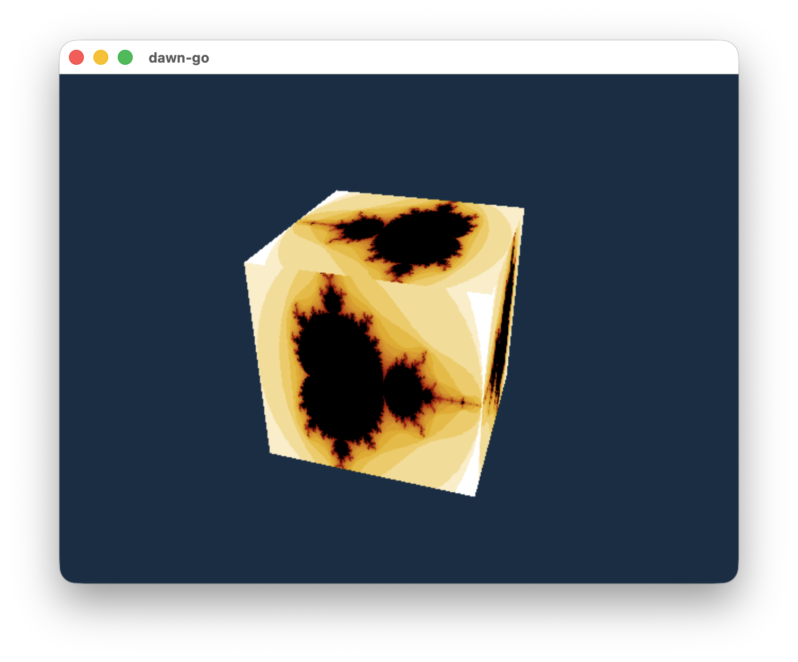
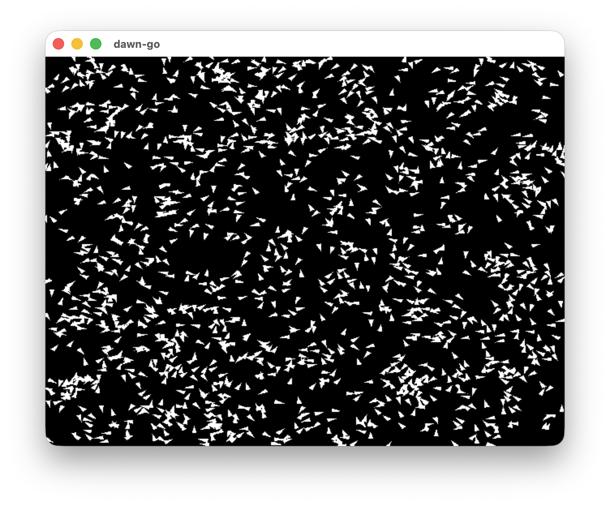

# Dawn Go

<p align="center">
    
</p>

[](https://pkg.go.dev/github.com/bluescreen10/dawn-go)
[](https://github.com/bluescreen10/dawn-go/actions)
[](https://codecov.io/gh/bluescreen10/dawn-go)
[](https://goreportcard.com/report/github.com/bluescreen10/dawn-go)


Go bindings for Google Dawn (WebGPU).

## Overview
**Dawn Go** provides idiomatic Go bindings for [Google Dawn](https://github.com/google/dawn),  
an implementation of the **WebGPU** standard.

It enables high-performance, cross-platform GPU programming in Go with a modern API aligned with WebGPU.

## Getting Started

Install the module:

```bash
go get github.com/bluescreen10/dawn-go
```

## Examples
To learn how to use this module, explore [examples](examples) directory:

<table border=0>
  <tr>
    <td align="center">
        
        <a href="examples/cube">Cube</a>
    </td>
    <td align="center">
        
        <a href="examples/boids">Boids</a>
    </td>
  </tr>
  <tr>
  </tr>
</table>

## Pre-compiled binaries
This module includes precompiled Dawn binaries for:
- Windows
- Linux
- macOS
- Android

Binaries are sourced from the official Dawn [releases](https://github.com/google/dawn/releases/)
The Go module is updated regularly (typically monthly) to stay aligned with upstream improvements and bug fixes.

## Third Party License & Acknowledgements
Note that this is built on top of [Google Dawn](https://github.com/google/dawn),
which is licensed under the BSD 3-Clause License. See THIRD_PARTY_NOTICES for details.