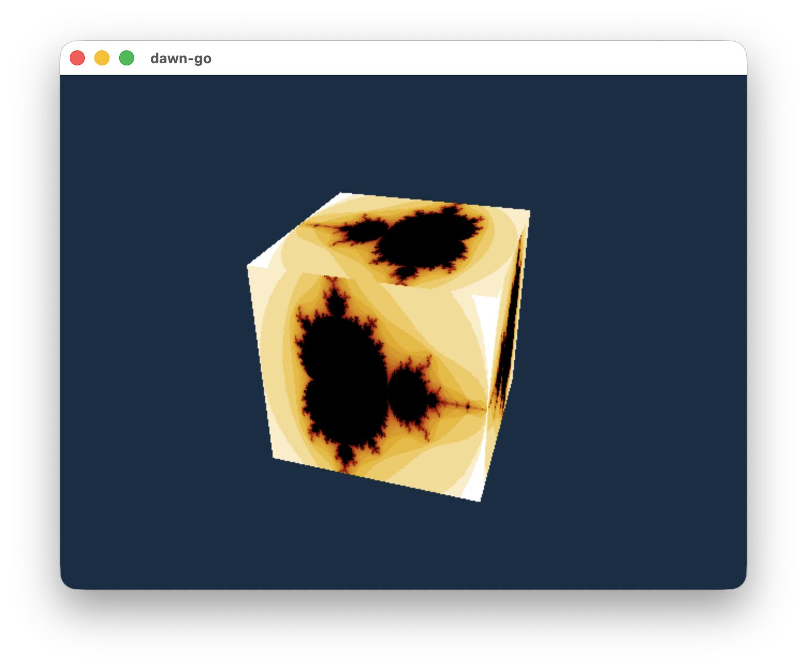
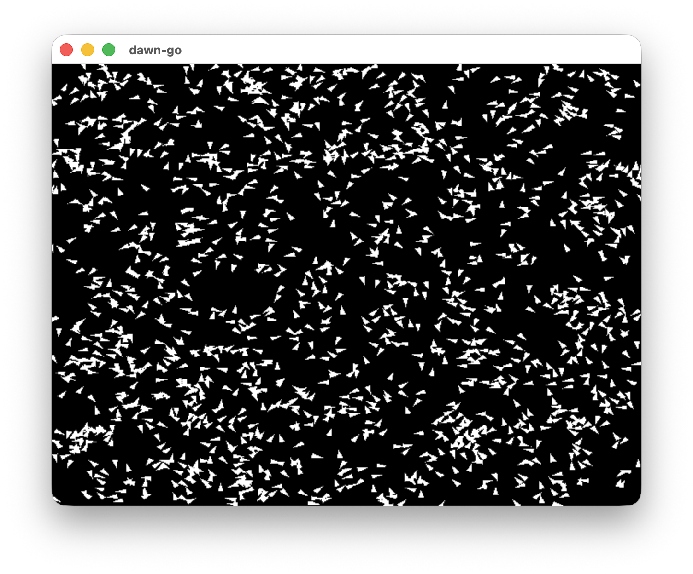

# Dawn Go

<p align="center">
    
</p>

[](https://pkg.go.dev/github.com/bluescreen10/dawn-go)
[](https://github.com/bluescreen10/dawn-go/actions)
[](https://codecov.io/gh/bluescreen10/dawn-go)
[](https://goreportcard.com/report/github.com/bluescreen10/dawn-go)


Go bindings for Google Dawn (WebGPU).

## Overview
**Dawn Go** provides idiomatic Go bindings for [Google Dawn](https://github.com/google/dawn),  
an implementation of the **WebGPU** standard.

It enables high-performance, cross-platform GPU programming in Go with a modern API aligned with WebGPU.

## Getting Started

Install the module:

```bash
go get github.com/bluescreen10/dawn-go
```

## Examples
To learn how to use this module, explore [examples](examples) directory:

<table border=0>
  <tr>
    <td align="center">
        
        <a href="examples/cube">Cube</a>
    </td>
    <td align="center">
        
        <a href="examples/boids">Boids</a>
    </td>
  </tr>
  <tr>
  </tr>
</table>

## Native Dawn library

Dawn's compiled binaries are too large to ship inside a Go module (Go enforces a
500MB cap per module version), so **this module does not vendor any platform
binaries**. Before building, you need `libwebgpu_dawn` (the compiled library)
and `webgpu.h` (its matching header) available on disk, and you need to tell
`cgo` where to find both:

- `CGO_LDFLAGS` — needs `-L<dir containing the library>`, so the linker can find it.
- `CGO_CFLAGS` — needs `-I<dir containing webgpu.h>`, so the compiler can find the header.

Both are required, and **both must come from the same Dawn release** — the
header defines the exact struct layouts and function signatures the library
was built with, so pairing a header from one version with a library from
another is a real ABI-mismatch risk, not just a style preference.

General shape (append rather than overwrite, in case something else in your
toolchain already sets these):

```bash
export CGO_LDFLAGS="$CGO_LDFLAGS -L/path/to/dawn/lib"
export CGO_CFLAGS="$CGO_CFLAGS -I/path/to/dawn/include"
```

Get a matching library+header pair one of two ways:

**Option 1: vcpkg (cross-platform)**

```bash
vcpkg install dawn
export CGO_LDFLAGS="$CGO_LDFLAGS -L$VCPKG_ROOT/installed/<triplet>/lib"
export CGO_CFLAGS="$CGO_CFLAGS -I$VCPKG_ROOT/installed/<triplet>/include"
```

Replace `<triplet>` with your vcpkg triplet (e.g. `arm64-osx`, `x64-linux`, `x64-windows`).

**Option 2: Manual download**

Download the release matching your platform from the
[Dawn releases page](https://github.com/google/dawn/releases/latest), extract
it, and point at the extracted directories. The library subdirectory name
differs by platform — note Linux uses `lib64`, not `lib`:

| Platform | Release asset | Library path | Header path |
|---|---|---|---|
| macOS (Apple Silicon) | `*-macos-latest-Release.tar.gz` | `lib/` | `include/` |
| macOS (Intel) | `*-macos-15-intel-Release.tar.gz` | `lib/` | `include/` |
| Linux | `*-ubuntu-latest-Release.tar.gz` | `lib64/` | `include/` |
| Windows | `*-windows-latest-Release.tar.gz` | `lib/` | `include/` |

The header path is the tarball's `include/` directory itself (it contains a
`webgpu/webgpu.h`, which is what this module includes) — don't point at
`include/webgpu/` directly, since that header itself pulls in `dawn/webgpu.h`
from the parent directory.

```bash
export CGO_LDFLAGS="$CGO_LDFLAGS -L/path/to/extracted/lib64"   # or lib, per the table above
export CGO_CFLAGS="$CGO_CFLAGS -I/path/to/extracted/include"
```

Android additionally requires the Android NDK toolchain configured for cgo
cross-compilation (`CC`/`CXX` pointing at the NDK's clang for your target ABI);
the Dawn library itself comes from the `dawn-android` release asset, which is
split per-ABI (`arm64-v8a`, `armeabi-v7a`, `x86`, `x86_64`).

Once both env vars are set, `go build`/`go run`/`go test` all work normally.

## Third Party License & Acknowledgements
Note that this is built on top of [Google Dawn](https://github.com/google/dawn),
which is licensed under the BSD 3-Clause License. See THIRD_PARTY_NOTICES for details.